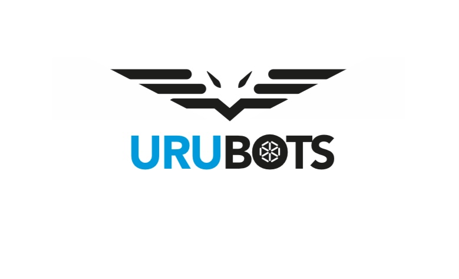

  <!-- Logo da tua equipe -->
  

<h1 align="center">🤖 UruBots - RoboCup 2026 @Work</h1>

  <b>Developing a mobile manipulator for RoboCup 2026 – Incheon</b> 
  <i>Powered by ROS 2 Humble, LIMO (AgileX), Hokuyo LiDAR, and OpenManipulator</i>

---

  <!-- Logos lado a lado -->
  
  
  

---

## 🏆 Project Overview
This repository documents the development of our robotic system for the **RoboCup 2026 – Incheon (@Work league)**.  
Our mission is to build a fully autonomous mobile manipulator capable of performing navigation, object detection, and manipulation tasks in a dynamic environment.

## 🔧 Hardware
- **Base**: LIMO (AgileX Robotics) – 1/10 scale versatile robot platform  
- **LiDAR**: Hokuyo UST series – 270° scanning, up to 10 m range  
- **Manipulator**: Robotis OpenManipulator-X – 4 DOF robotic arm  
- **Computing**: Intel NUC + NVIDIA Jetson (hybrid AI + control)  

## 🖥️ Software Stack
- **ROS 2 Humble**  
- **Navigation2 (Nav2)**    
- Custom ROS 2 packages for navigation, perception, and manipulation  

---
